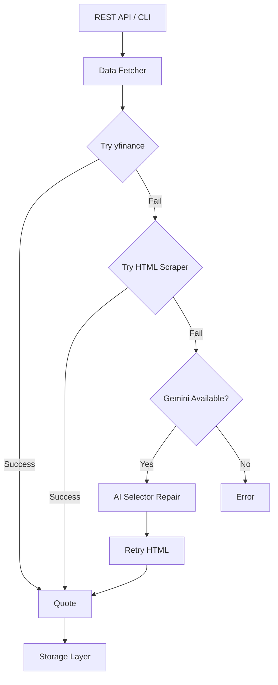

# Stock Price API with AI Scraping

A robust Python stock price API that uses `yfinance` as the primary data source, HTML scraping as a fallback, and Google Gemini AI as an LLM assistant for intelligent selector maintenance.

## Architecture



## Features

- **Multiple data sources**: yfinance (primary) + HTML scraping (fallback)
- **Gemini LLM integration**: Automatic selector discovery and repair when scraping fails
- **CLI interface**: Easy-to-use commands for quotes, history, and batch processing
- **Data persistence**: Save quotes and history to CSV/Parquet files
- **Rate limiting**: Built-in rate limiting to be a good citizen
- **Retry logic**: Automatic retries with exponential backoff

## Installation

1. Clone the repository:
   ```bash
   git clone <repo-url>
   cd stock-price-scraper
   ```

2. Create and activate a virtual environment:
   ```bash
   python -m venv .venv
   .venv\Scripts\activate  # Windows
   # or
   source .venv/bin/activate  # Linux/Mac
   ```

3. Install dependencies:
   ```bash
   pip install -r requirements.txt
   ```

4. Configure environment variables:
   ```bash
   cp .env.example .env
   # Edit .env with your settings
   ```

## Configuration

Create a `.env` file with the following variables:

```env
GEMINI_API_KEY=your_api_key_here  # Optional, for LLM features
RATE_LIMIT_REQUESTS_PER_SECOND=1
USE_YFINANCE=True
USE_HTML_FALLBACK=True
USE_GEMINI_ASSISTANT=True
```

## Usage

### Get a Single Quote

```bash
python -m src.app.cli quote AAPL
python -m src.app.cli quote MSFT --save --json
```

### Get Historical Data

```bash
python -m src.app.cli history AAPL --period 1mo
python -m src.app.cli history TSLA --start 2024-01-01 --end 2024-06-01 --save
python -m src.app.cli history GOOGL --period 1y --format parquet --save
```

### Batch Processing

```bash
python -m src.app.cli batch --tickers AAPL,MSFT,GOOGL,AMZN
python -m src.app.cli batch --tickers TSLA,META,NVDA --save --json
```

### Test Configuration

```bash
python -m src.app.cli test
```

## REST API

### Start the API Server

```bash
uvicorn src.app.api:app --reload --port 8000
```

### API Endpoints

| Method | Endpoint | Description |
|--------|----------|-------------|
| GET | `/` | API info |
| GET | `/health` | Health check |
| GET | `/quote/{ticker}` | Get latest quote |
| GET | `/history/{ticker}` | Get historical data |
| GET | `/batch?tickers=A,B,C` | Batch quotes |
| POST | `/quote/{ticker}/save` | Fetch and save quote |

### Example Requests

```bash
# Get quote
curl http://localhost:8000/quote/AAPL

# Get history with period
curl "http://localhost:8000/history/AAPL?period=1mo"

# Batch quotes
curl "http://localhost:8000/batch?tickers=AAPL,MSFT,GOOGL"
```

### Interactive Docs
- Swagger UI: http://localhost:8000/docs
- ReDoc: http://localhost:8000/redoc

## Project Structure

```
stock-price-scraper/
├── src/
│   ├── core/
│   │   ├── config.py      # Environment configuration
│   │   ├── models.py      # Pydantic data models
│   │   └── storage.py     # CSV/Parquet persistence
│   ├── data_sources/
│   │   ├── yahoo_yfinance.py  # yfinance wrapper
│   │   └── yahoo_html.py      # HTML scraper fallback
│   ├── llm/
│   │   ├── gemini_client.py      # Gemini SDK wrapper
│   │   └── scraping_assistant.py # LLM-powered helpers
│   └── app/
│       ├── api.py           # FastAPI REST API
│       ├── cli.py           # Command-line interface
│       └── data_fetcher.py  # Unified data fetcher
├── tests/
├── data/                    # Output data files
├── requirements.txt
├── .env.example
├── LICENSE
└── README.md
```

## Data Models

### Quote
- `ticker`: Stock symbol
- `price`: Current price
- `currency`: Currency code
- `timestamp`: Quote timestamp
- `source`: Data source (yfinance/yahoo_html)
- `change`: Price change
- `change_percent`: Percentage change
- `volume`: Trading volume

### HistoricalBar
- `ticker`: Stock symbol
- `date`: Bar date
- `open`, `high`, `low`, `close`: OHLC prices
- `adj_close`: Adjusted close
- `volume`: Trading volume

## Gemini Integration

When HTML scraping fails, the scraper can use Gemini to:
- **Suggest new selectors**: Analyze HTML and propose CSS selectors
- **Repair broken selectors**: Fix selectors when Yahoo changes their markup
- **Validate scraped data**: Check if parsed prices look plausible

To enable Gemini features, set `GEMINI_API_KEY` in your `.env` file.

## License

MIT
