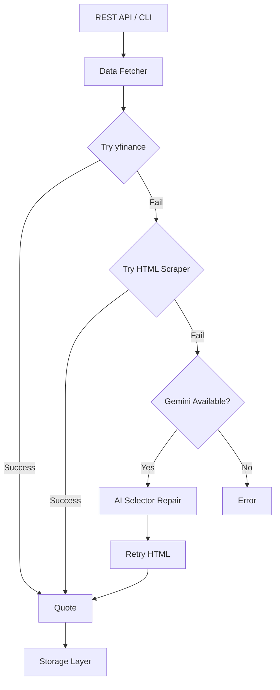

# Stock Price API with AI Scraping

A robust Python stock price API that uses `yfinance` as the primary data source, HTML scraping as a fallback, and Google Gemini AI as an LLM assistant for intelligent selector maintenance. Deployable to AWS Lambda as a containerized function.

## Architecture



## Features

- **Multiple data sources**: yfinance (primary) + HTML scraping (fallback)
- **Gemini LLM integration**: Automatic selector discovery and repair when scraping fails
- **CLI interface**: Easy-to-use commands for quotes, history, and batch processing
- **Data persistence**: Save quotes and history to CSV/Parquet files
- **Rate limiting**: Built-in rate limiting to be a good citizen
- **Retry logic**: Automatic retries with exponential backoff
- **AWS Lambda deployment**: Containerized deployment with SAM

## Installation

### Local Development

1. Clone the repository:
   ```bash
   git clone <repo-url>
   cd stock-price-api
   ```

2. Create and activate a virtual environment:
   ```bash
   python -m venv .venv
   source .venv/bin/activate  # Linux/Mac
   # or
   .venv\Scripts\activate  # Windows
   ```

3. Install dependencies:
   ```bash
   pip install -r requirements.txt
   ```

4. Configure environment variables:
   ```bash
   cp .env.example .env
   # Edit .env with your settings
   ```

## Configuration

Create a `.env` file with the following variables:

```env
GEMINI_API_KEY=your_api_key_here  # Optional, for LLM features
RATE_LIMIT_REQUESTS_PER_SECOND=1
USE_YFINANCE=True
USE_HTML_FALLBACK=True
USE_GEMINI_ASSISTANT=True
```

## CLI Usage

### Get a Single Quote

```bash
python -m src.app.cli quote AAPL
python -m src.app.cli quote MSFT --save --json
```

### Get Historical Data

```bash
python -m src.app.cli history AAPL --period 1mo
python -m src.app.cli history TSLA --start 2024-01-01 --end 2024-06-01 --save
python -m src.app.cli history GOOGL --period 1y --format parquet --save
```

### Batch Processing

```bash
python -m src.app.cli batch --tickers AAPL,MSFT,GOOGL,AMZN
python -m src.app.cli batch --tickers TSLA,META,NVDA --save --json
```

### Test Configuration

```bash
python -m src.app.cli test
```

## REST API

### Local Development Server

```bash
uvicorn src.app.api:app --reload --port 8000
```

### Authentication

All endpoints except `/` and `/health` require API key authentication via the `X-API-Key` header.

**Setting up authentication:**

1. Set the `API_KEY` environment variable:
   ```bash
   export API_KEY=your-secret-api-key
   ```

2. Include the header in all requests:
   ```bash
   curl -X POST https://your-api-endpoint/quote \
     -H "Content-Type: application/json" \
     -H "X-API-Key: your-secret-api-key" \
     -d '{"ticker": "AAPL"}'
   ```

**Note:** If `API_KEY` is not set, the API runs in public mode (no authentication required).

### API Endpoints

All data endpoints use POST requests with JSON payloads.

| Method | Endpoint | Description |
|--------|----------|-------------|
| GET | `/` | API info |
| GET | `/health` | Health check |
| POST | `/quote` | Get latest quote |
| POST | `/history` | Get historical data |
| POST | `/batch` | Batch quotes |
| POST | `/save` | Fetch and save quote |

### Request Payloads

#### Get Quote
```json
POST /quote
{
    "ticker": "AAPL"
}
```

#### Get History
```json
POST /history
{
    "ticker": "AAPL",
    "period": "1mo",
    "start": "2024-01-01",
    "end": "2024-06-01"
}
```

#### Batch Quotes
```json
POST /batch
{
    "tickers": ["AAPL", "MSFT", "GOOGL"]
}
```

#### Save Quote
```json
POST /save
{
    "ticker": "AAPL"
}
```

### Example Requests (curl)

```bash
# Get quote
curl -X POST https://your-api-endpoint/quote \
  -H "Content-Type: application/json" \
  -H "X-API-Key: your-api-key" \
  -d '{"ticker": "AAPL"}'

# Get history with period
curl -X POST https://your-api-endpoint/history \
  -H "Content-Type: application/json" \
  -H "X-API-Key: your-api-key" \
  -d '{"ticker": "AAPL", "period": "1mo"}'

# Batch quotes
curl -X POST https://your-api-endpoint/batch \
  -H "Content-Type: application/json" \
  -H "X-API-Key: your-api-key" \
  -d '{"tickers": ["AAPL", "MSFT", "GOOGL"]}'

# Health check (no auth required)
curl https://your-api-endpoint/health
```

### Interactive Docs
- Swagger UI: `https://your-api-endpoint/docs`
- ReDoc: `https://your-api-endpoint/redoc`

## AWS Lambda Deployment

### Prerequisites

- [AWS CLI](https://aws.amazon.com/cli/) configured with credentials
- [AWS SAM CLI](https://docs.aws.amazon.com/serverless-application-model/latest/developerguide/install-sam-cli.html)
- Docker

### Deploy

```bash
# Deploy to default region (eu-central-1)
./deploy.sh

# Deploy to different region
AWS_REGION=us-east-1 ./deploy.sh
```

### Manual SAM Commands

```bash
# Build container image
sam build --use-container

# Deploy (guided first time)
sam deploy --guided

# Local testing
sam local start-api
```

### View Logs

```bash
# Tail logs in real-time
sam logs -n StockPriceApi --stack-name stock-price-api --tail --region eu-central-1

# Or using AWS CLI
aws logs tail /aws/lambda/stock-price-api --follow --region eu-central-1
```

### Set Gemini API Key

```bash
sam deploy --parameter-overrides GeminiApiKey=your-key-here
```

## Project Structure

```
stock-price-api/
├── src/
│   ├── core/
│   │   ├── config.py          # Environment configuration
│   │   ├── models.py          # Pydantic data models
│   │   └── storage.py         # CSV/Parquet persistence
│   ├── data_sources/
│   │   ├── yahoo_yfinance.py  # yfinance wrapper
│   │   └── yahoo_html.py      # HTML scraper fallback
│   ├── llm/
│   │   ├── gemini_client.py      # Gemini SDK wrapper
│   │   └── scraping_assistant.py # LLM-powered helpers
│   └── app/
│       ├── api.py             # FastAPI REST API
│       ├── cli.py             # Command-line interface
│       ├── data_fetcher.py    # Unified data fetcher
│       └── lambda_handler.py  # AWS Lambda handler
├── tests/
├── Dockerfile                 # AWS Lambda container image
├── template.yaml              # AWS SAM template
├── samconfig.toml             # SAM CLI configuration
├── deploy.sh                  # Deployment script
├── requirements.txt
├── .env.example
├── LICENSE
└── README.md
```

## Data Models

### Quote
- `ticker`: Stock symbol
- `price`: Current price
- `currency`: Currency code
- `timestamp`: Quote timestamp
- `source`: Data source (yfinance/yahoo_html)
- `change`: Price change
- `change_percent`: Percentage change
- `volume`: Trading volume
- `market_cap`: Market capitalization

### HistoricalBar
- `ticker`: Stock symbol
- `date`: Bar date
- `open`, `high`, `low`, `close`: OHLC prices
- `adj_close`: Adjusted close
- `volume`: Trading volume

## Gemini Integration

When HTML scraping fails, the scraper can use Gemini to:
- **Suggest new selectors**: Analyze HTML and propose CSS selectors
- **Repair broken selectors**: Fix selectors when Yahoo changes their markup
- **Validate scraped data**: Check if parsed prices look plausible

To enable Gemini features, set `GEMINI_API_KEY` in your `.env` file or pass it during deployment.

## Testing

Run the test suite:

```bash
# Run all tests
pytest

# Run with coverage
pytest --cov=src --cov-report=term-missing

# Run specific test file
pytest tests/test_api.py -v
```

## CI/CD

The project uses GitHub Actions for continuous integration and deployment. The pipeline triggers on version tags (`v*`).

**Pipeline stages:**
1. **Lint** - Code quality checks with ruff
2. **Test** - Run pytest with coverage
3. **Build** - Build Docker image
4. **Deploy** - Deploy to AWS Lambda (on tags only)

**Required GitHub Secrets:**
- `AWS_ACCESS_KEY_ID` - AWS access key
- `AWS_SECRET_ACCESS_KEY` - AWS secret key
- `API_KEY` - API authentication key
- `GEMINI_API_KEY` - (Optional) Gemini API key

**Creating a release:**
```bash
git tag v1.0.0
git push origin v1.0.0
```

## License

MIT
